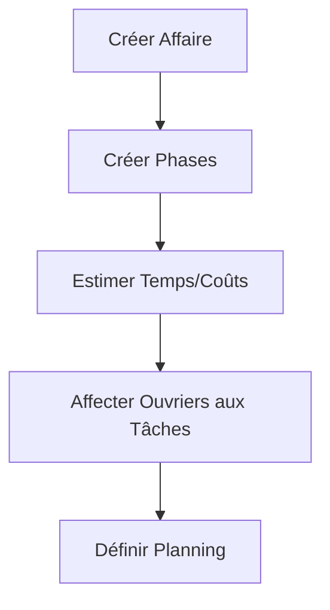
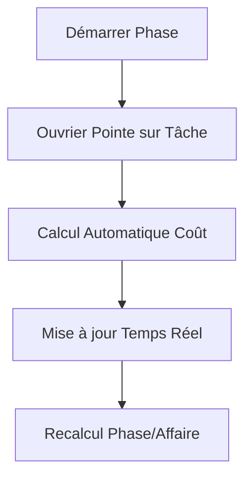
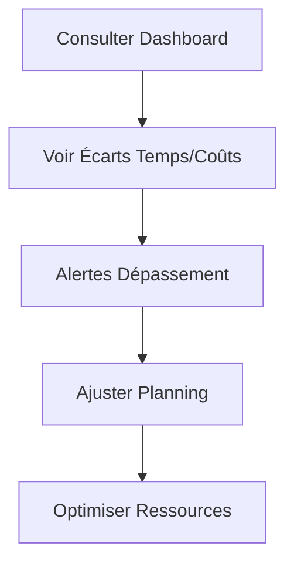

# 🚀 Système de Gestion des Équipes & Temps

## 📊 Vue d'ensemble

Ce système permet de gérer la main-d'œuvre de manière complète avec :
- **Planification des phases** de chantier (Fabrication, Pose, SAV, etc.)
- **Affectation d'ouvriers** aux tâches spécifiques
- **Suivi temps réel** vs estimation
- **Calcul automatique des coûts** de main-d'œuvre
- **Intégration dans les camemberts financiers**

## 🗄️ Structure de la Base de Données

### Nouveaux Modèles

#### `PhaseChantier`
```prisma
model PhaseChantier {
  id                String         @id @default(uuid())
  nom               String         // Ex: "Fabrication cuisines"
  typePhase         TypePhase      // FABRICATION, POSE, SERVICE, etc.
  statut            StatutPhase    // PLANIFIEE, EN_COURS, TERMINEE
  
  // Planification
  dateDebutPrevue   DateTime?
  dateFinPrevue     DateTime?
  tempsEstimeH      Float          // Temps estimé total
  coutEstime        Float          // Coût estimé total
  
  // Réalisé (calculé automatiquement)
  dateDebutReelle   DateTime?
  dateFinReelle     DateTime?
  tempsReelH        Float          // Somme des heures des tâches
  coutReel          Float          // Somme des coûts des tâches
  
  // Relations
  affaire           Affaire        @relation(fields: [affaireId], references: [id])
  taches            TacheAffectation[]
}
```

#### `TacheAffectation`
```prisma
model TacheAffectation {
  id                String         @id @default(uuid())
  nom               String         // Ex: "Montage meubles hauts"
  statut            StatutTache    // ASSIGNEE, EN_COURS, TERMINEE
  
  // Planification
  tempsEstimeH      Float          // Temps estimé pour cette tâche
  coutEstime        Float          // Coût estimé (temps × taux horaire)
  
  // Réalisé (calculé à partir des pointages)
  tempsReelH        Float          // Somme des pointages
  coutReel          Float          // Somme des coûts des pointages
  
  // Relations
  phase             PhaseChantier  @relation(fields: [phaseId], references: [id])
  ouvrierAffecte    User           @relation(fields: [ouvrierAffecteId], references: [id])
  pointages         Pointage[]     // Pointages liés à cette tâche
}
```

#### Modifications du modèle `Pointage`
```prisma
model Pointage {
  // ... champs existants
  coutCalcule     Float     @default(0) // nbHeures × taux horaire utilisateur
  
  // Nouvelle relation optionnelle vers une tâche
  tacheId         String?
  tache           TacheAffectation? @relation(fields: [tacheId], references: [id])
}
```

## 🔄 Flux de Travail

### 1. **Planification**


### 2. **Exécution**


### 3. **Suivi**


## 🎯 Fonctionnalités Clés

### **A. Gestion des Phases**
- **Types prédéfinis** : Fabrication, Pose, Livraison, SAV, Service
- **Statuts** : Planifiée, En cours, Terminée, Annulée
- **Planification** : Dates de début/fin, estimations temps/coûts
- **Suivi réel** : Calcul automatique à partir des tâches

### **B. Affectation des Tâches**
- **Affectation nominative** : Un ouvrier par tâche
- **Estimations granulaires** : Temps et coût par tâche
- **Gestion des statuts** : Assignée → En cours → Terminée
- **Lien avec pointages** : Traçabilité complète

### **C. Calculs Automatiques**
```typescript
// Coût d'un pointage
coutPointage = nbHeures × tarifHoraireOuvrier

// Totaux d'une tâche
tempsReelTache = Σ(pointages.nbHeures)
coutReelTache = Σ(pointages.coutCalcule)

// Totaux d'une phase
tempsReelPhase = Σ(taches.tempsReelH)
coutReelPhase = Σ(taches.coutReel)
```

### **D. Intégration Financière**
- **Nouveau segment** dans les camemberts : Main-d'œuvre (en bleu)
- **Structure** : CA = Achats + Main-d'œuvre + Marge
- **Alertes** : Dépassement budget main-d'œuvre
- **Reporting** : Évolution coûts MO par affaire

## 🏗️ Architecture Backend

### Modules Créés
```
src/modules/
├── phases/
│   ├── dto/
│   │   ├── create-phase.dto.ts
│   │   └── update-phase.dto.ts
│   ├── phases.controller.ts
│   ├── phases.service.ts
│   └── phases.module.ts
└── taches-affectation/
    ├── dto/
    │   ├── create-tache.dto.ts
    │   └── update-tache.dto.ts
    ├── taches.controller.ts
    ├── taches.service.ts
    └── taches.module.ts
```

### API Endpoints

#### Phases (`/phases`)
- `POST /phases` - Créer une phase
- `GET /phases` - Lister avec filtres (affaireId, typePhase, statut)
- `GET /phases/:id` - Détail d'une phase
- `GET /phases/:id/stats` - Statistiques d'une phase
- `PATCH /phases/:id` - Modifier une phase
- `PATCH /phases/:id/calculate` - Recalculer les données réelles
- `DELETE /phases/:id` - Supprimer une phase

#### Tâches (`/taches`)
- `POST /taches` - Affecter un ouvrier à une tâche
- `GET /taches` - Lister avec filtres (phaseId, ouvrierAffecteId, statut)
- `GET /taches/:id` - Détail d'une tâche
- `PATCH /taches/:id` - Modifier une tâche
- `PATCH /taches/:id/status` - Changer le statut
- `DELETE /taches/:id` - Supprimer une tâche

## 🎨 Interface Frontend (À venir)

### Nouveaux Composants
1. **`AffaireEquipe.jsx`** - Gestion équipe d'une affaire
2. **`PhasesList.jsx`** - Liste des phases
3. **`TacheAffectation.jsx`** - Affectation des tâches
4. **`PlanningGantt.jsx`** - Vue planning
5. **`StatsMainOeuvre.jsx`** - Statistiques MO

### Intégrations
- **Camemberts financiers** - Ajout segment Main-d'œuvre
- **Dashboard affaires** - Alertes coûts MO
- **Planning général** - Vue équipes/ressources

## 📈 Bénéfices

### **Pilotage**
- ✅ Visibilité complète sur les coûts de main-d'œuvre
- ✅ Détection précoce des dépassements
- ✅ Optimisation de l'affectation des ressources

### **Rentabilité**
- ✅ Calcul précis des marges réelles
- ✅ Facturation au temps passé
- ✅ Amélioration continue des estimations

### **Opérationnel**
- ✅ Planning adaptatif en temps réel
- ✅ Suivi individuel des performances
- ✅ Répartition équitable de la charge

## 🚀 Prochaines Étapes

### Phase 1 : Fondations ✅
- [x] Modèles de données
- [x] Migrations
- [x] API Backend (phases)
- [ ] API Backend (tâches)

### Phase 2 : Interface
- [ ] Composants frontend
- [ ] Intégration dans AffaireDetails
- [ ] Nouveaux camemberts

### Phase 3 : Optimisations
- [ ] Planning automatique
- [ ] Prédictions IA
- [ ] Alertes intelligentes

---

**🎯 Vision** : Transformer la gestion artisanale en pilotage industriel tout en gardant la flexibilité métier ! 